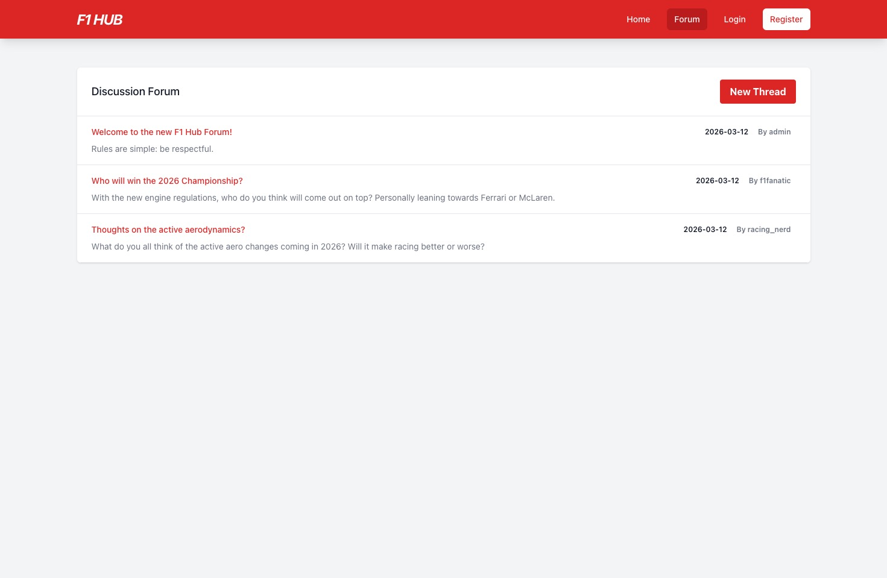

# F1 Hub - Formula 1 Blog & Forum

A full-stack web application for Formula 1 news and discussions. Built with FastAPI, SQLite, Python, HTML, Tailwind CSS and JavaScript.

## Features

- **Homepage**: Latest F1 news feed fetched using NewsAPI
- **Forum**: Discussion threads with view functionality
- **Authentication**: User registration and login functionality stored in SQLite database
- **API Backend**: RESTful HTTP endpoints via FastAPI

### UI Screenshots

  
*Homepage displaying fetched F1 news*

  
*Forum page with discussion threads*

  
*Authentication page for users*

## Setup

1. **Clone the repository:**
   ```bash
   git clone https://github.com/janicksturm/f1_forum.git
   cd f1_forum
   ```

2. **Create a virtual environment and install dependencies:**
   ```bash
   python3 -m venv venv
   source venv/bin/activate
   pip install -r requirements.txt
   ```

3. **Configure Environment Variables:**
   - Create a `.env` file in the root directory.
   - Add your [NewsAPI](https://newsapi.org/) key:
     ```
     NEWS_API_KEY=your_api_key_here
     ```

4. **Run the Development Server:**
   ```bash
   fastapi dev main.py
   ```

5. **Open in Browser:**
   Navigate to [http://127.0.0.1:8000](http://127.0.0.1:8000)

## Project Structure

- `main.py`: Main FastAPI application, routing and APIs
- `public/`: HTML templates
- `static/`: Static assets
- `src/`: Backend modules
- `data/`: SQLite database
- `requirements.txt`: Python package dependencies

## Technologies

- **Backend**: Python, FastAPI, SQLite
- **Frontend**: HTML5, Tailwind CSS, JavaScript
- **APIs**: NewsAPI
- **AI Assistant**: Antigravity
